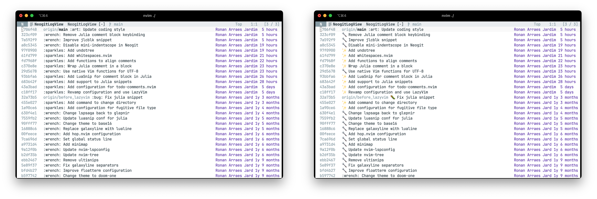

# Emojify.nvim

This package adds the capability to emojify the buffers considering the Github markdown emoji codes.
Notice that it uses Neovim extended mark capability, meaning the buffer is not modified.

After enabling emojify, `:sparkles:` will be rendered as ✨, for example.

> [!IMPORTANT]
> This plugin is in alpha stage.

## Installation

The recommended way to install the plugin is using lazy.nvim as plugin manager:

```lua
{
  "ronisbr/emojify.nvim",
  cmd = "Emojify",
  config = function ()
    require("emojify").setup()
  end,
  lazy = true,
}

This plugin requires `conceallevel >= 1` to work properly. To set it, execute:
`:set conceallevel=1`.
```
## Usage

Execute `:Emojify` to toggle the emojify mode.

## Screenshot

The figure to the left shows a Neogit log without emojify mode whereas the figure to the
right shows the same buffer with emojify enabled.



## References

This plugin was inspired by [emacs-emojify](https://github.com/iqbalansari/emacs-emojify).
